# 🛍️ VISTORA – Fashion E-Commerce App

**VISTORA** is a modern **Flutter-based fashion e-commerce mobile application** inspired by platforms like **Zara** and **Nike**.
It delivers a smooth, elegant, and responsive shopping experience for **Men, Women, and Kids**.

The app is built with a **Feature-Based Architecture** and uses **Cubit (BLoC)** for scalable and maintainable state management.

---

## ✨ Features

* 👕 Browse fashion categories (Men, Women, Kids)
* 🛍️ Smooth shopping experience
* 🔍 Smart product search
* ❤️ Wishlist / Favorites system
* 🧾 Product details page
* 🛒 Cart management with real-time updates
* 👤 User profile management
* 🔐 Authentication (Login & Register)
* 💳 Checkout system (Payment ready)
* 📱 Clean & responsive UI

---

## 🚀 Advanced Features

* 🔥 Firebase Authentication (Login / Register / Logout)
* ☁️ Cloud Firestore Database Integration
* 🧠 State Management using Cubit (BLoC)
* 🧱 Feature-Based Clean Architecture
* 🔄 Real-time Cart Updates
* 💳 Payment Integration with Paymob
* 📦 Scalable & Maintainable Code Structure
* 📱 Fully Responsive UI (ScreenUtil)

---

## 📸 App Screenshots

### 🚀 Splash

<p align="center">
  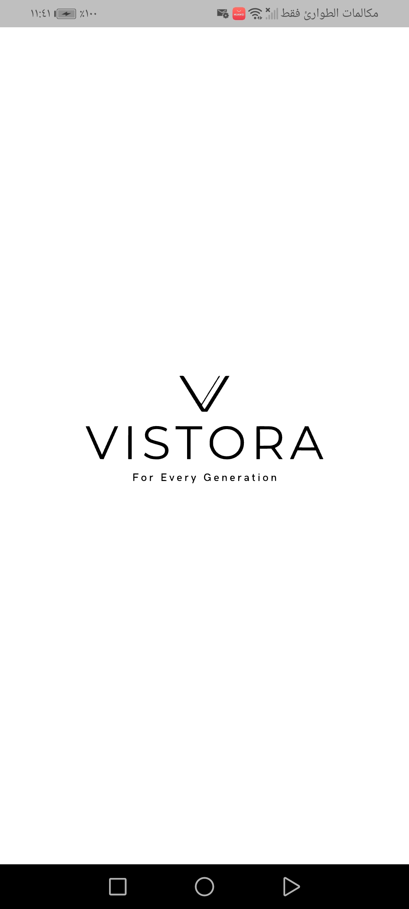
</p>

---

### 🚀 Onboarding

<p align="center">
  
  
  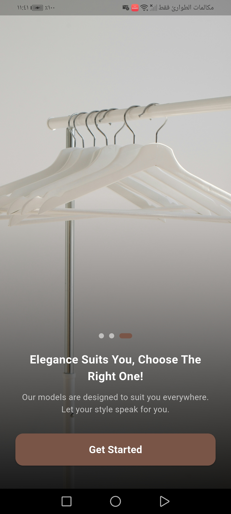
</p>

---

### 🔐 Authentication

<p align="center">
  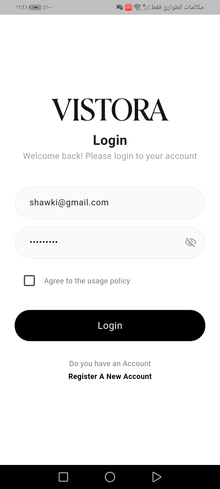
  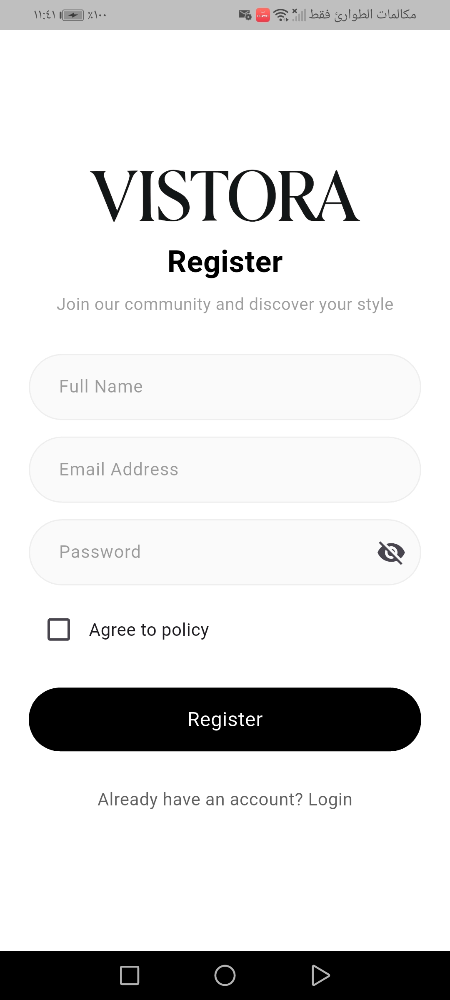
</p>

---

### 🏠 Home & Products

<p align="center">
  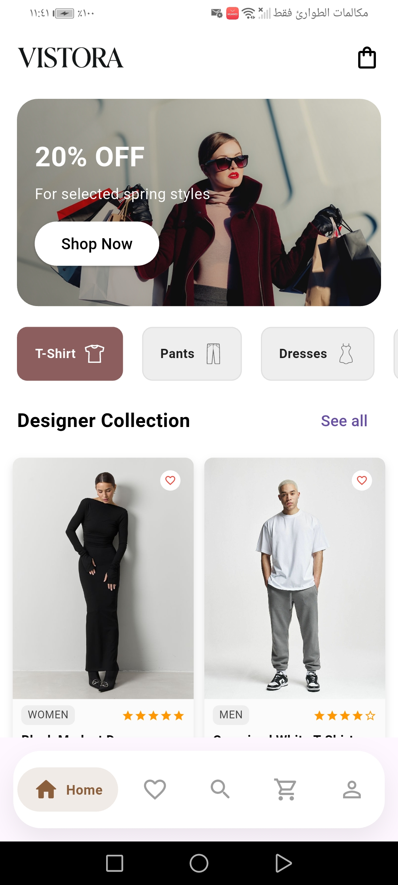
  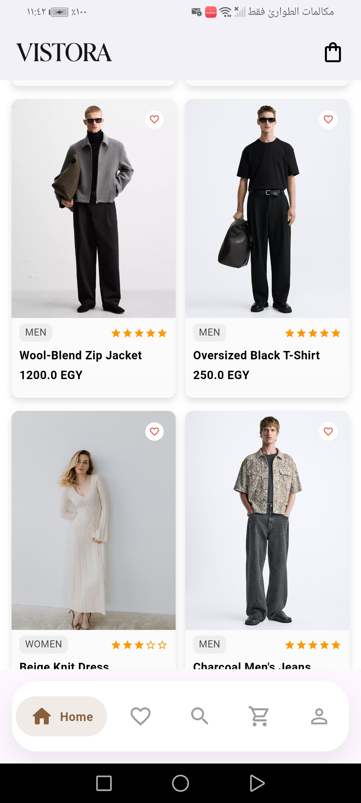
  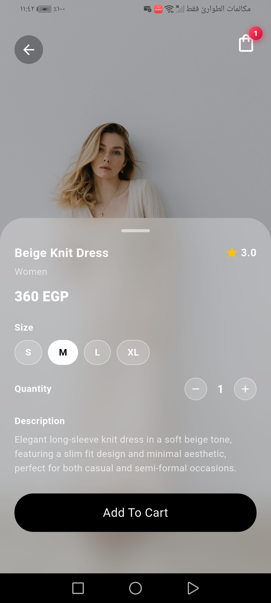
</p>

<p align="center">
  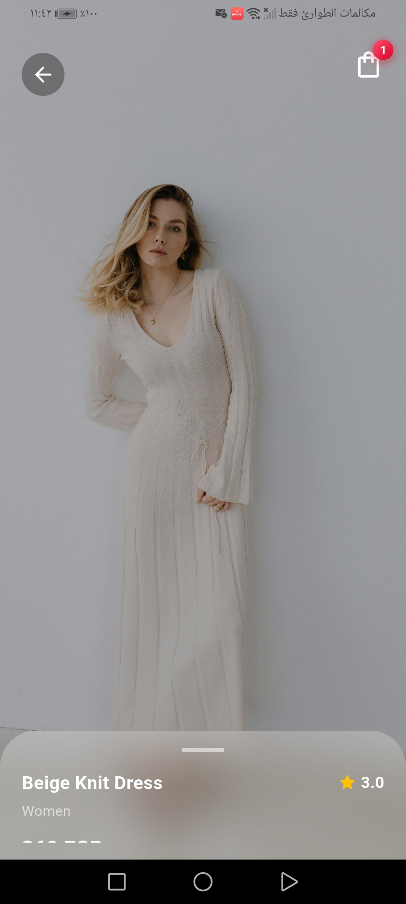
  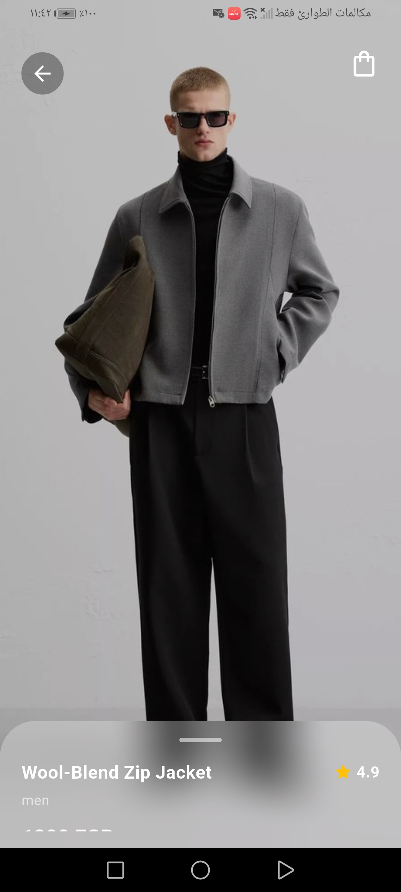
</p>

---

### 🔍 Search

<p align="center">
  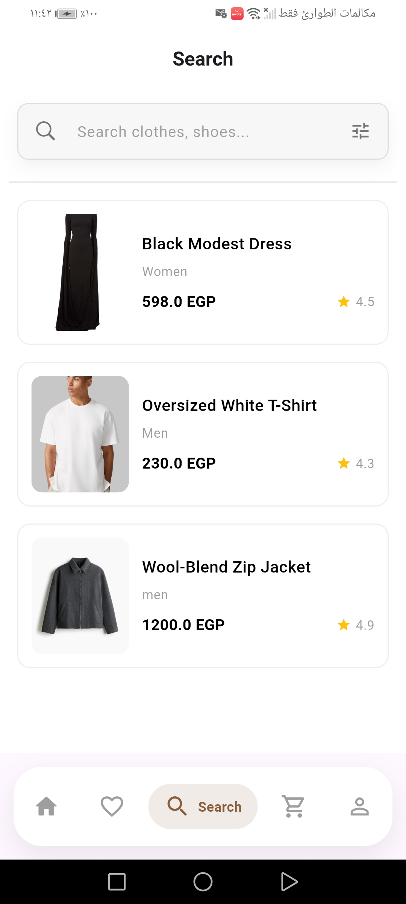
</p>

---

### ❤️ Favorites

<p align="center">
  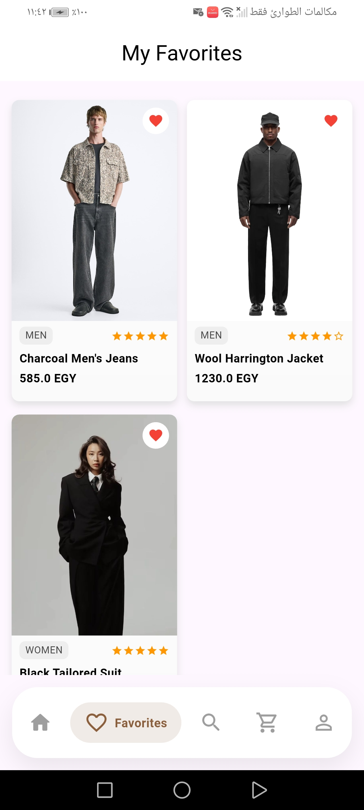
</p>

---

### 🛒 Cart & Checkout

<p align="center">
  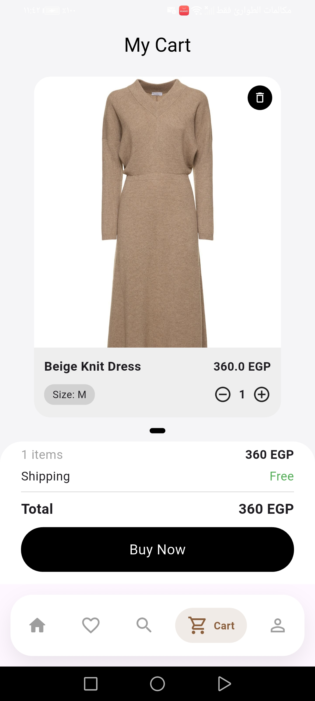
  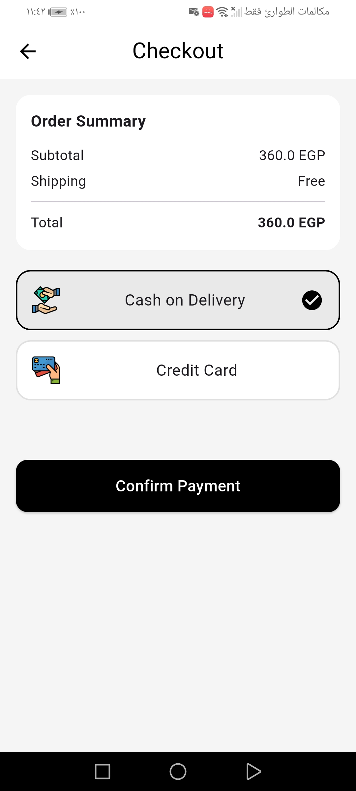
  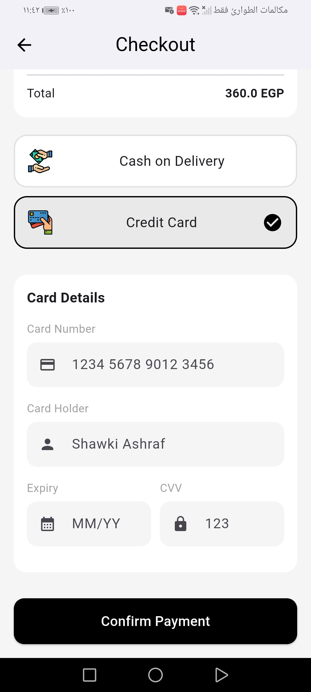
</p>

---

### 👤 Profile

<p align="center">
  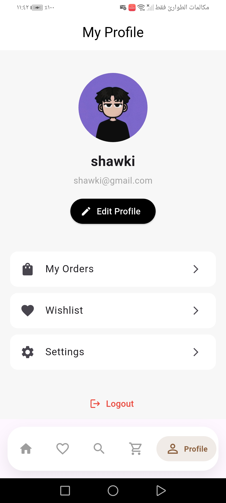
</p>

---

## 🛠️ Tech Stack

* 🟦 Flutter
* 🎯 Dart
* 🔥 Firebase (Authentication & Firestore)
* 🧠 Cubit (BLoC State Management)
* 📐 ScreenUtil (Responsive UI)
* 💳 Paymob (Payment Integration)

---

## 🧱 Architecture

The project follows a **Feature-Based Clean Architecture (Lightweight)**:

* `core/` → Shared services (API, Firebase, constants)
* `features/` → Each feature is modular and independent

  * `cubit/` → State management
  * `data/` → Models & repositories
  * `view/` → UI screens
  * `widgets/` → Reusable components

---

## 📂 Project Structure

```bash
lib/
│
├── core/
│   ├── apiservice.dart
│   ├── firebase_service.dart
│   ├── checkout.dart
│   ├── constant.dart
│
├── features/
│   ├── auth/
│   ├── cart/
│   ├── favorite/
│   ├── home/
│   ├── onboarding/
│   ├── productsdetails/
│   ├── profile/
│   ├── search/
│   ├── shared_widgets/
│
└── main.dart
```

---

## 🚀 Getting Started

```bash
git clone https://github.com/shawki-ashraf/VISTORA-APP.git
cd VISTORA-APP
flutter pub get
flutter run
```

---

## 💡 Future Improvements

* 📦 Order tracking system
* 🌍 Multi-language support
* 🔔 Push notifications
* ⭐ Product reviews & ratings

---

## 👨‍💻 Author

**Shawky Ashraf**
Flutter Developer 🚀
